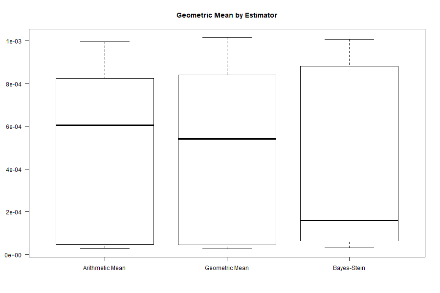
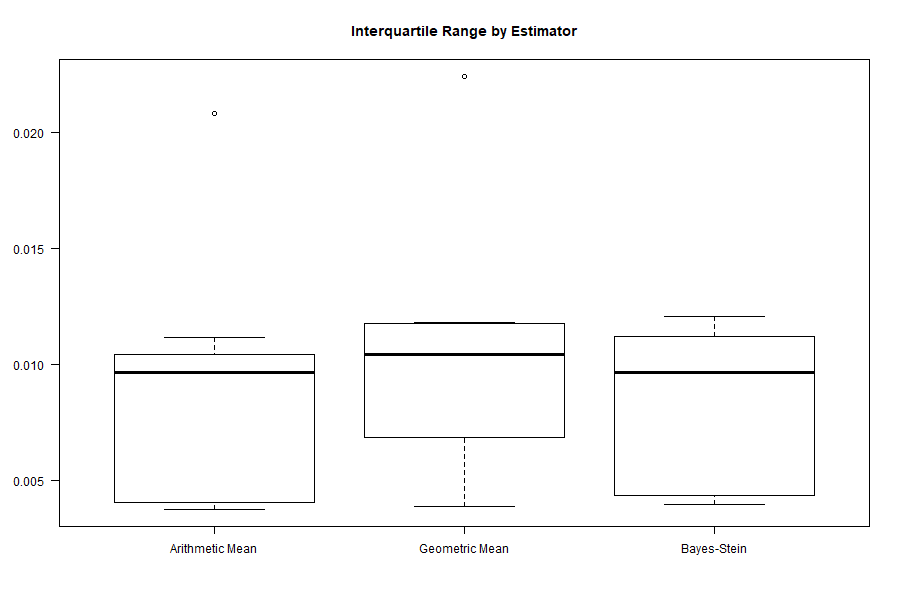
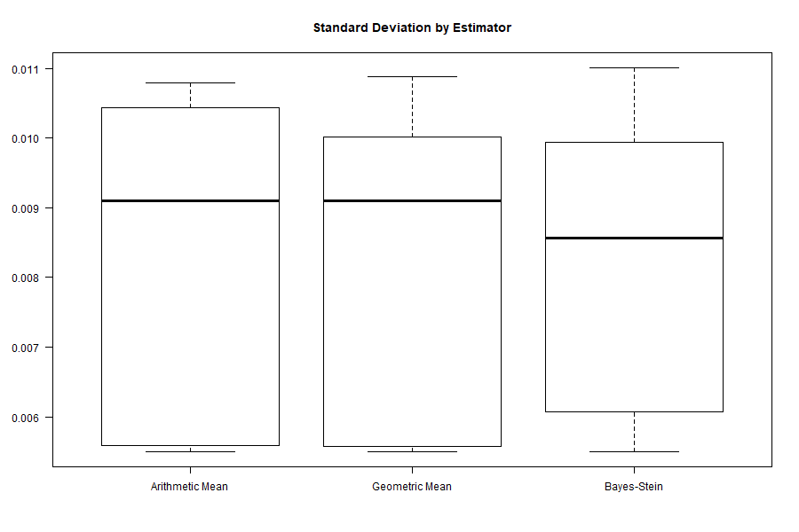
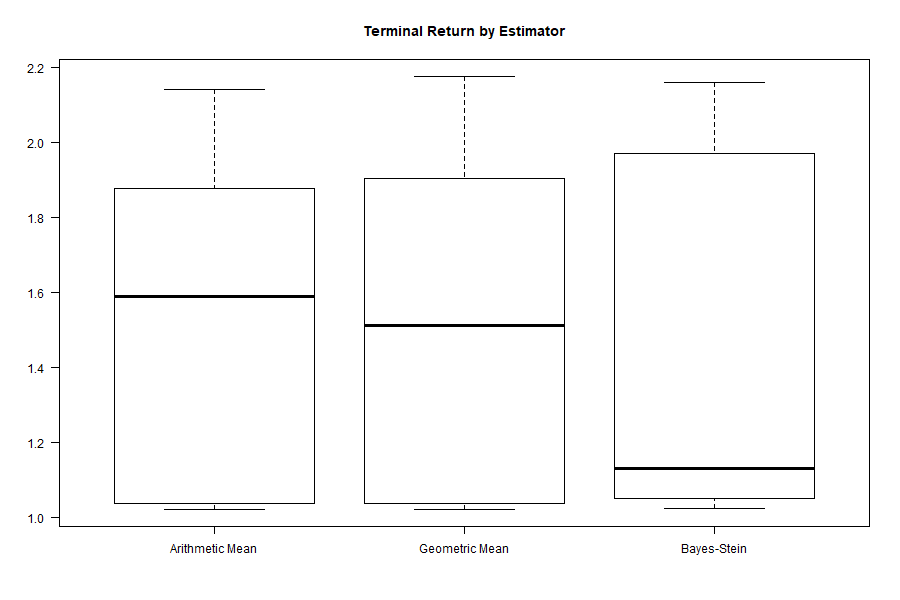
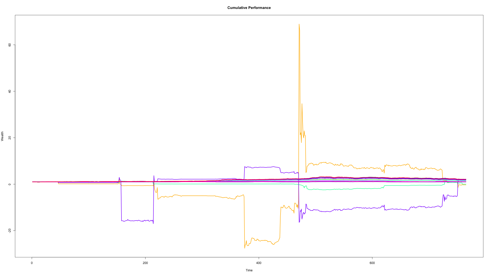
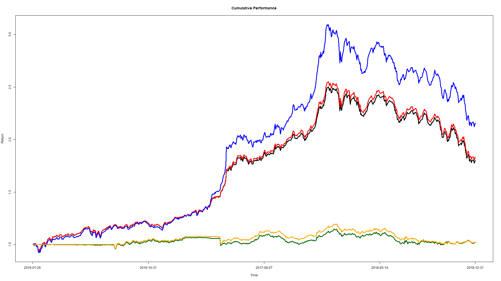
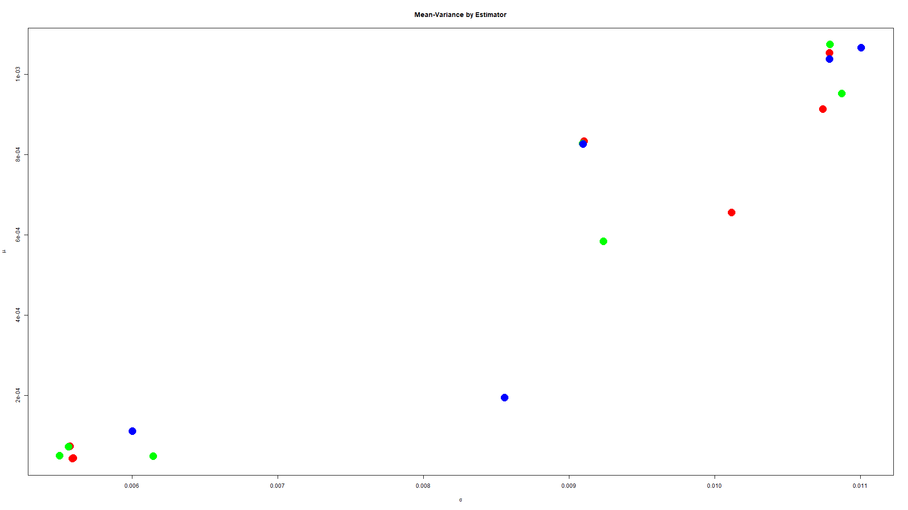
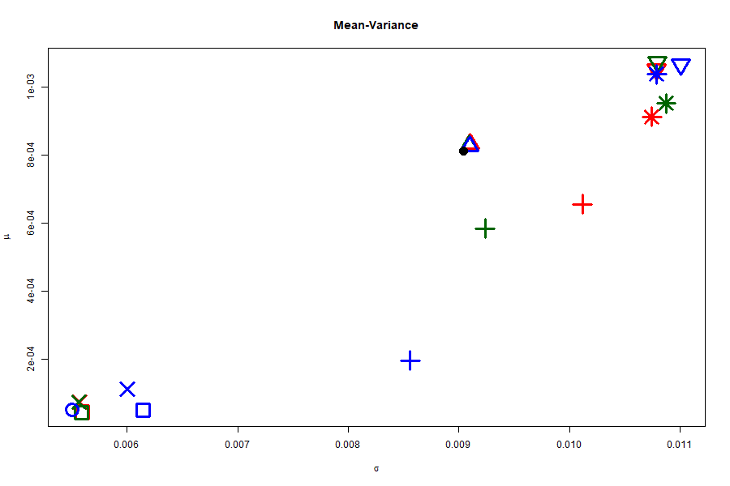

[](http://quantlet.de/)

## [](http://quantlet.de/) **EMAIS_Visual** [](http://quantlet.de/)

```yaml


Name of Quantlet: 'EMAIS_Visual'

Published in: 'Bachelor Thesis: Evaluation of Multi-Asset Investment Strategies with Digital Assets'

Description: 'This Quantlet produces visual results of the optimization routines. It gives information about (cumulated) performance, density, success metrics and their reliability as well as results according to strategies and estimators.'

Keywords: 'plot, boxplot, density, performance, table, dispersion, t-test, shapiro, wilk, test, normality, sharpe, ceq'

Author: 'Erin Dirk Spruenken'

See also: 'EMAIS_DataManip, EMAIS_ParamEst, EMAIS_Optim'

Datafile: 'functions.R, Results.RData, dates.RData'
```




















### R Code
```r

rm(list = ls())
graphics.off()

#set proper working direcotry
dir = "D:/Dropbox/Studium/B.Sc. Economics/Bachelorarbeit/EMAIS_git/EMAIS_Visual"
setwd(dir)

load("Results.RData")
load("dates.RData")
source("functions.R")
lib = c("xtable", "moments", "psych")
if(!(lib %in% installed.packages())){install.packages(lib)}
lapply(lib, library, character.only = T)
options(scipen = 999)
M = 120

################################
#### descriptive statistics ####
################################

    get.summary = function(x){c(min(x), quantile(x, c(0.25, 0.5)), mean(x), geometric.mean(x), quantile(x, 0.75), max(x), sd(x), skewness(x), kurtosis(x))} #function to report summary statistics of a vector
    des = as.data.frame(matrix(nrow = length(P), ncol = 10))
    colnames(des) = c("Min", "1st Quartile", "Median", "Arithmetic Mean", "Geometric Mean", "3rd Quartile", "Max", "Standard Deviation", "Skewness", "Kurtosis")
    rownames(des) = names.new
    for(i in 1:nrow(des)){
      des[i,] = get.summary(P[[i]])
    }
    
    des.1 = format(round(des, 4), nsmall = 4)
    des.2 = as.data.frame(apply(des.1, 2, FUN = function(x) paste0("$", x, "$")))
    row.names(des.2) = names.new
    
    sink(file = "des_stat.txt")
      print(xtable(des.2), sanitize.text.function=function(x){x})
    sink()

###########################
#### statistical tests ####
###########################

    normal.test = lapply(P, shapiro.test) #Test for normality using shapiro wilk test
    
    normal.res = round(as.numeric(lapply(normal.test, "[[", 2)),4) #extract p-value
    skewness.res = abs(round(as.numeric(lapply(P, skewness)),4)) #Skewness of Portfolios
    
    T.1 = lapply(P[-1], t.test, mu = mean(P[[1]])) #two sided t-test, external mean is the mean of the naive portfolio
    T.1 = round(as.numeric(lapply(T.1, "[[", 3)),4) #extract p-value
    
    test.table = data.frame(skewness.res, normal.res, c(NA,T.1))
    test.table = apply(test.table, 2, FUN = function(x) format(round(x,4), nsmall = 4))
    row.names(test.table) = names.new
    colnames(test.table)  = c("\\lvert Skewness \\rvert", "p-value (SW-Test)", "p-value (t-Test)")
    x.test = xtable(test.table)
    
    x.test.2 = as.data.frame(apply(x.test, 2, FUN = function(x) paste0("$", x, "$")))
    row.names(x.test.2) = names.new
    colnames(x.test.2)  = c("$\\lvert \\hat{S} \\rvert$", "p-value (SW-Test)", "p-value (t-Test)")
    print(xtable(x.test.2), sanitize.text.function=function(x){x})
    
    sink(file = "test.txt")
      print(xtable(x.test.2), sanitize.text.function=function(x){x})
    sink()

    #report which strategies have mean significantly different from naive mean on the ...
    # ... 10% level:
    p.10 = (names.new[1 + which(T.1 <= 0.1 & T.1 > 0.05)])
    
    # ... 5% level:
    p.5 = (names.new[1 + which(T.1 <= 0.05 & T.1 > 0.01)])
    
    # ... 1% level:
    p.1 = (names.new[1 + which(T.1 <= 0.01 & T.1 > 0.001)])
    
    # ... 0.1% level
    p.0 = (names.new[1 + which(T.1 <= 0.001)])
    
    sapply(p.10, FUN = function(x) print(paste0("Auf dem 10% Niveau ist ", x, " signifikant!")))
    sapply(p.5, FUN = function(x) print(paste0("Auf dem 5% Niveau ist ", x, " signifikant!")))
    sapply(p.1, FUN = function(x) print(paste0("Auf dem 1% Niveau ist ", x, " signifikant!")))
    sapply(p.0, FUN = function(x) print(paste0("Auf dem 0.1% Niveau ist ", x, " signifikant!")))

#############################
#### performance metrics ####
#############################

    psi.res = as.data.frame(matrix(nrow = length(P), ncol = 4))
    for(i in 1:length(P)){
      psi.res[i,] = psi(P[[i]], W[[i]], gamma = gam)
    }
    
    #create gross returns
    P.gross = lapply(P, FUN = function(x){
      1+x
    })
    
    #calculate wealth at each time, which equals := Prod_i=1^T (P.gross)_(i)*x_(i-1) && x_(0) = 1
    perf = lapply(P.gross, cumprod)
    perf.1 = sapply(perf, tail, 1) ## == Terminal Wealth at the End
    
    #0 means zero money left, 1 is what you started with, negative means you have debt outstanding
    
    psi.res = as.data.frame(cbind(psi.res, perf.1))
    colnames(psi.res) = c("CEQ", "SR", "ASR", "TO", "TR") #TR for Terminal Wealth
    rownames(psi.res) = names.new
    psi.res = format(round(psi.res, 4), nsmall = 4)
    xres = xtable(psi.res, digits = 4)
    
    xres.2 = as.data.frame(apply(xres, 2, FUN = function(x) paste0("$", x, "$")))
    row.names(xres.2) = names.new
    print(xtable(xres.2), sanitize.text.function=function(x){x})
    
    #xtable(psi.res.2)
    save(psi.res, file = "psi-results.RData")
    options(scipen = 0)
    
    sink(file = "psi-res.txt")
      print(xtable(xres.2), sanitize.text.function=function(x){x})
    sink()

###############
#### plots ####
###############

    #find maximum and minimum performance for axis
    #plot all cumulative returns
    g.min = min(sapply(perf, min)) #global minimum
    g.max = max(sapply(perf, max)) #global maximum
    
    #which strategy had the highest terminal wealth?
    
    names(P)[which(sapply(perf, tail, 1)==max(sapply(perf, tail, 1)))]
    
    for(i in 1:length(perf)){
      png(file = paste0("./performance/", names(P)[i], ".png"), width = 1920, height = 1080)
      plot(perf[[i]], xlab = "Time", ylab = "Wealth", main = "Cumulative Performance", type = "l", lwd = 2.3, xaxt = "n")
      axis(1, at = c(0,200,400,600,765), labels = dates.tck[c(M+1, M+200, M+400, M+600, M+765)])
      dev.off()
    }
    
    #plot specific results
    #Prepare
    min.1 = min(sapply(perf[c(1, 5, 24)], min))
    max.1 = max(sapply(perf[c(1, 5, 24)], max))
    perf.1 = as.numeric(lapply(perf, "[", length(perf[[1]])))
    
    #Plot
    png(file = "performance_1.png", width = 1920, height = 1080)
    plot(perf[[1]], xlab = "Time", ylab = "Return", main = "Cumulative Performance", ylim = c(min.1, max.1), type = "l", lwd = 3, xaxt = "n")#, xaxs = "i")
    lines(perf[[2]], col = "darkgreen", lwd = 3) #Constrained Minimum Variance (AM)
    lines(perf[[5]], col = "red", lwd = 3) # F-Geometric Mean Maximization (AM)
    lines(perf[[24]], col = "blue", lwd = 3) # LIBRO-CVaR (BS)
    lines(perf[[19]], col = "orange", lwd = 3) # Global Minimum Variance (BS)
    axis(1, at = c(0,200,400,600,765), labels = dates.tck[c(M+1, M+200, M+400, M+600, M+765)])
    dev.off()
    
    #Boxplots
    #Prepare
    mu = as.numeric(lapply(P, mean))
    sig = as.numeric(lapply(P, sd))
    med.1 = as.numeric(lapply(P, median))
    iqr.1 = as.numeric(lapply(P, IQR))
    mu.1 = mu[-c(1,4,12,20)] #remove naive and outliers (SR strategies)
    sig.1 = sig[-c(1,4,12,20)]
    names(mu.1) = names(P)[-c(1,4,12,20)]
    names(sig.1) = names(mu.1)
    names(med.1) = names(mu.1)
    names(iqr.1) = names(mu.1)
    gm.mean = as.numeric(lapply(P.gross, FUN = function(x){-1 + geometric.mean(x)}))
    gm.mean.1 = gm.mean[-c(1,4,12,20)]
    names(gm.mean.1) = names(mu.1)
    perf.2 = perf.1[-c(1,4,12,20)]
    names(perf.2) = names(mu.1)
    
    #plots
    png(file = "boxplot_mean.png", width = 900, height = 600)
      boxplot(main = "Mean Return by Estimator", mu.1[1:7], mu.1[8:14], mu.1[15:21], las = 2) #non-robust location parameter
      axis(1, labels = c("Arithmetic Mean", "Geometric Mean", "Bayes-Stein"), at = c(1,2,3))
    dev.off()
    
    png(file = "boxplot_sd.png", width = 900, height = 600)
      boxplot(sig.1[1:7], sig.1[8:14], sig.1[15:21], main = "Standard Deviation by Estimator", las = 2) #non-robust disperion parameter
      axis(1, labels = c("Arithmetic Mean", "Geometric Mean", "Bayes-Stein"), at = c(1,2,3))
    dev.off()
    
    png(file = "boxplot_med.png", width = 900, height = 600)
      boxplot(med.1[1:7], med.1[8:14], med.1[15:21], main = "Median Return by Estimator", las = 2) #robust location parameter
      axis(1, labels = c("Arithmetic Mean", "Geometric Mean", "Bayes-Stein"), at = c(1,2,3))
    dev.off()
    
    png(file = "boxplot_iqr.png", width = 900, height = 600)
      boxplot(iqr.1[1:7], iqr.1[8:14], iqr.1[15:21], main = "Interquartile Range by Estimator", las = 2) #robust dispersion parameter
      axis(1, labels = c("Arithmetic Mean", "Geometric Mean", "Bayes-Stein"), at = c(1,2,3))
    dev.off()
    
    png(file = "boxplot_tr.png", width = 900, height = 600)
      boxplot(perf.2[1:7], perf.2[8:14], perf.2[15:21], main = "Terminal Return by Estimator", las = 2) #final outcome
      axis(1, labels = c("Arithmetic Mean", "Geometric Mean", "Bayes-Stein"), at = c(1,2,3))
    dev.off()
    
    png(file = "boxplot_gm.png", width = 900, height = 600)
      boxplot(gm.mean.1[1:7], gm.mean.1[8:14], gm.mean.1[15:21], main = "Geometric Mean by Estimator", las = 2) #geometric mean
      axis(1, labels = c("Arithmetic Mean", "Geometric Mean", "Bayes-Stein"), at = c(1,2,3))
    dev.off()
    
    #Density plots
    for(i in 1:length(perf)){
      png(file = paste0("./density/", names(P)[i], ".png"), width = 1920, height = 1080)
      plot(density(P[[i]]*100), main = "Kernel Density Estimate", type = "l", lwd = 3, xlab = "Return in %")
      abline(v = mean(P[[i]]), lwd = 3, col = "red")
      abline(v = median(P[[i]]), lwd = 3, col = "blue")
      dev.off()
    }
    
    
    #Scatterplots    
    min.2 = min(mu.1)
    max.2 = max(mu.1)
    x.min = min(sig.1)
    x.max = max(sig.1)
    
    png(file = "scatter_est.png", width = 1920, height = 1080)
      plot(main = "Mean-Variance by Estimator", x = sig.1, y = mu.1, cex =3, pch = 19, col = rep(c("red", "green", "blue"), each = 8), xlab = expression(sigma), ylab = expression(mu), ylim = c(min.2, max.2), xlim = c(x.min, x.max)) #red AM, green GM, blue BS
    dev.off()
    
    png(file = "scatter_strat.png", width = 1920, height = 1080)
      plot(main = "Mean-Variance by Strategy", xlab = expression(sigma), ylab = expression(mu), sig.1[c(1,2,3,8,9,10,15,16,17)], mu.1[c(1,2,3,8,9,10,15,16,17)], cex = 3, pch = 19, col = rep(c("red", "green", "blue"), 3), ylim = c(min.2, max.2), xlim = c(x.min, x.max))
      points(sig.1[c(4,5,6,11,12,13,18,19,20)], mu.1[c(4,5,6,11,12,13,18,19,20)], cex = 3, pch = 4, col = rep(c("red", "green", "blue"), 3), lwd = 3)
      points(sig.1[c(7,14,21)], mu.1[c(7,14,21)], cex = 3, pch = 17, col = "blue")    
    dev.off()
    
    png(file = "scatter_total.png", width = 900, height = 600)
      plot(main = "Mean-Variance", xlab = expression(sigma), ylab = expression(mu), x = sig.1, y = mu.1, cex = 3, col = rep(c("red", "darkgreen", "blue"), each = 7), ylim = c(min.2, max.2), xlim = c(x.min, x.max), pch = c(0,1,2,3,4,6,8), lwd = 3)
      points(x = sig[1], y = mu[1], pch = 19, col = "black", cex = 2)
    dev.off()
    
    ##################################################################################################
    ##### The following is the same plotting script but produces PDF-files instead of png files! #####
    ##################################################################################################
    
    for(i in 1:length(perf)){
      pdf(file = paste0("./performance/", names(P)[i], ".pdf"), width = 9, height = 6)
      plot(perf[[i]], xlab = "Time", ylab = "Wealth", main = "Cumulative Performance", type = "l", lwd = 2.3, xaxt = "n")
      axis(1, at = c(0,200,400,600,765), labels = dates.tck[c(M+1, M+200, M+400, M+600, M+765)])
      dev.off()
    }
    
    #plot specific results
    #Prepare
    min.1 = min(sapply(perf[c(1, 5, 24)], min))
    max.1 = max(sapply(perf[c(1, 5, 24)], max))
    perf.1 = as.numeric(lapply(perf, "[", length(perf[[1]])))
    
    #Plot
    pdf(file = "./performance_1.pdf", width = 9, height = 6)
    plot(perf[[1]], xlab = "Time", ylab = "Return", main = "Cumulative Performance", ylim = c(min.1, max.1), type = "l", lwd = 3, xaxt = "n")#, xaxs = "i")
    lines(perf[[2]], col = "darkgreen", lwd = 3) #Constrained Minimum Variance (AM)
    lines(perf[[5]], col = "red", lwd = 3) # F-Geometric Mean Maximization (AM)
    lines(perf[[24]], col = "blue", lwd = 3) # LIBRO-CVaR (BS)
    lines(perf[[19]], col = "orange", lwd = 3) # Global Minimum Variance (BS)
    axis(1, at = c(0,200,400,600,765), labels = dates.tck[c(M+1, M+200, M+400, M+600, M+765)])
    dev.off()
    
    #Boxplots
    #Prepare
    mu = as.numeric(lapply(P, mean))
    sig = as.numeric(lapply(P, sd))
    med.1 = as.numeric(lapply(P, median))
    iqr.1 = as.numeric(lapply(P, IQR))
    mu.1 = mu[-c(1,4,12,20)] #remove naive and outliers (SR strategies)
    sig.1 = sig[-c(1,4,12,20)]
    names(mu.1) = names(P)[-c(1,4,12,20)]
    names(sig.1) = names(mu.1)
    names(med.1) = names(mu.1)
    names(iqr.1) = names(mu.1)
    gm.mean = as.numeric(lapply(P.gross, FUN = function(x){-1 + geometric.mean(x)}))
    gm.mean.1 = gm.mean[-c(1,4,12,20)]
    names(gm.mean.1) = names(mu.1)
    perf.2 = perf.1[-c(1,4,12,20)]
    names(perf.2) = names(mu.1)
    
    #plots
    pdf(file = "./boxplot_mean.pdf", width = 9, height = 6)
    boxplot(main = "Mean Return by Estimator", mu.1[1:7], mu.1[8:14], mu.1[15:21], las = 2) #non-robust location parameter
    axis(1, labels = c("Arithmetic Mean", "Geometric Mean", "Bayes-Stein"), at = c(1,2,3))
    dev.off()
    pdf(file = "./boxplot_sd.pdf", width = 9, height = 6)
    boxplot(sig.1[1:7], sig.1[8:14], sig.1[15:21], main = "Standard Deviation by Estimator", las = 2) #non-robust disperion parameter
    axis(1, labels = c("Arithmetic Mean", "Geometric Mean", "Bayes-Stein"), at = c(1,2,3))
    dev.off()
    pdf(file = "./boxplot_med.pdf", width = 9, height = 6)
    boxplot(med.1[1:7], med.1[8:14], med.1[15:21], main = "Median Return by Estimator", las = 2) #robust location parameter
    axis(1, labels = c("Arithmetic Mean", "Geometric Mean", "Bayes-Stein"), at = c(1,2,3))
    dev.off()
    pdf(file = "./boxplot_iqr.pdf", width = 9, height = 6)
    boxplot(iqr.1[1:7], iqr.1[8:14], iqr.1[15:21], main = "Interquartile Range by Estimator", las = 2) #robust dispersion parameter
    axis(1, labels = c("Arithmetic Mean", "Geometric Mean", "Bayes-Stein"), at = c(1,2,3))
    dev.off()
    pdf(file = "./boxplot_tr.pdf", width = 9, height = 6)
    boxplot(perf.2[1:7], perf.2[8:14], perf.2[15:21], main = "Terminal Return by Estimator", las = 2) #final outcome
    axis(1, labels = c("Arithmetic Mean", "Geometric Mean", "Bayes-Stein"), at = c(1,2,3))
    dev.off()
    pdf(file = "./boxplot_gm.pdf", width = 9, height = 6)
    boxplot(gm.mean.1[1:7], gm.mean.1[8:14], gm.mean.1[15:21], main = "Geometric Mean by Estimator", las = 2) #geometric mean
    axis(1, labels = c("Arithmetic Mean", "Geometric Mean", "Bayes-Stein"), at = c(1,2,3))
    dev.off()
    
    #Density plots
    for(i in 1:length(perf)){
      pdf(file = paste0("./density/", names(P)[i], ".pdf"), width = 9, height = 6)
      plot(density(P[[i]]*100), main = "Kernel Density Estimate", type = "l", lwd = 3, xlab = "Return in %")
      abline(v = mean(P[[i]]), lwd = 3, col = "red")
      abline(v = median(P[[i]]), lwd = 3, col = "blue")
      dev.off()
    }
    
    
    #Scatterplots    
    min.2 = min(mu.1)
    max.2 = max(mu.1)
    x.min = min(sig.1)
    x.max = max(sig.1)
    pdf(file = "./scatter_est.pdf", width = 9, height = 6)
    plot(main = "Mean-Variance by Estimator", x = sig.1, y = mu.1, cex =3, pch = 19, col = rep(c("red", "green", "blue"), each = 8), xlab = expression(sigma), ylab = expression(mu), ylim = c(min.2, max.2), xlim = c(x.min, x.max)) #red AM, green GM, blue BS
    dev.off()
    
    pdf(file = "./scatter_strat.pdf", width = 9, height = 6)
    plot(main = "Mean-Variance by Strategy", xlab = expression(sigma), ylab = expression(mu), sig.1[c(1,2,3,8,9,10,15,16,17)], mu.1[c(1,2,3,8,9,10,15,16,17)], cex = 3, pch = 19, col = rep(c("red", "green", "blue"), 3), ylim = c(min.2, max.2), xlim = c(x.min, x.max))
    points(sig.1[c(4,5,6,11,12,13,18,19,20)], mu.1[c(4,5,6,11,12,13,18,19,20)], cex = 3, pch = 4, col = rep(c("red", "green", "blue"), 3), lwd = 3)
    points(sig.1[c(7,14,21)], mu.1[c(7,14,21)], cex = 3, pch = 17, col = "blue")    
    dev.off()
    
    pdf(file = "./scatter_total.pdf", width = 9, height = 6)
    plot(main = "Mean-Variance", xlab = expression(sigma), ylab = expression(mu), x = sig.1, y = mu.1, cex = 3, col = rep(c("red", "darkgreen", "blue"), each = 7), ylim = c(min.2, max.2), xlim = c(x.min, x.max), pch = c(0,1,2,3,4,6,8), lwd = 3)
    points(x = sig[1], y = mu[1], pch = 19, col = "black", cex = 2)
    dev.off()
```

automatically created on 2019-09-07